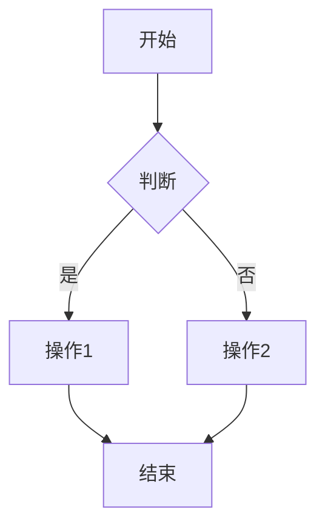
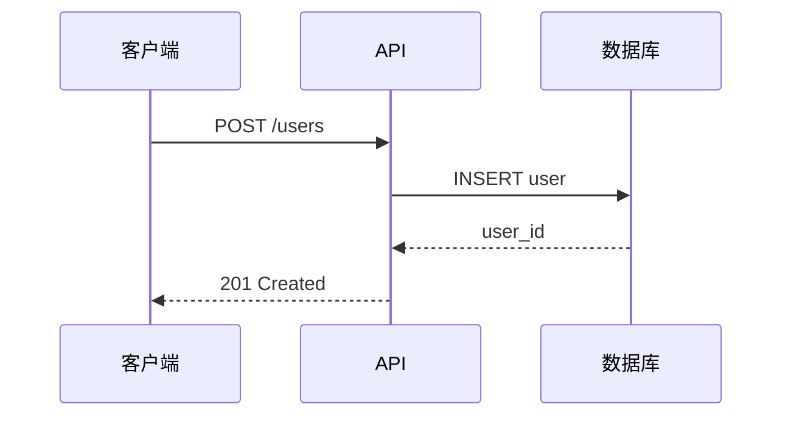
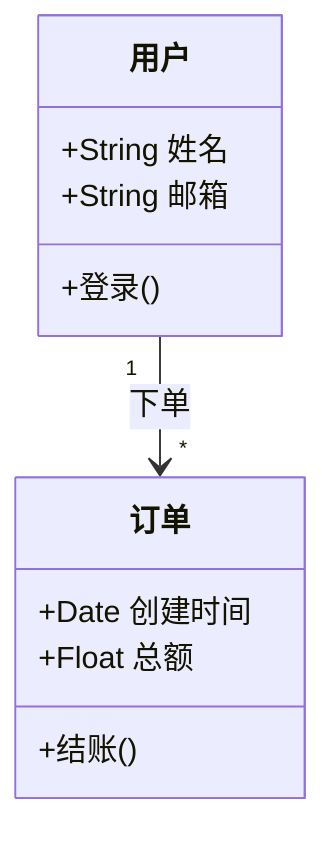
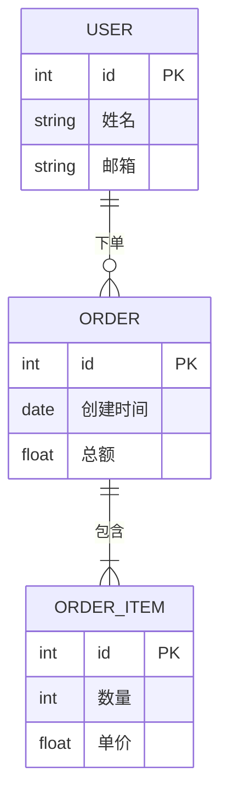
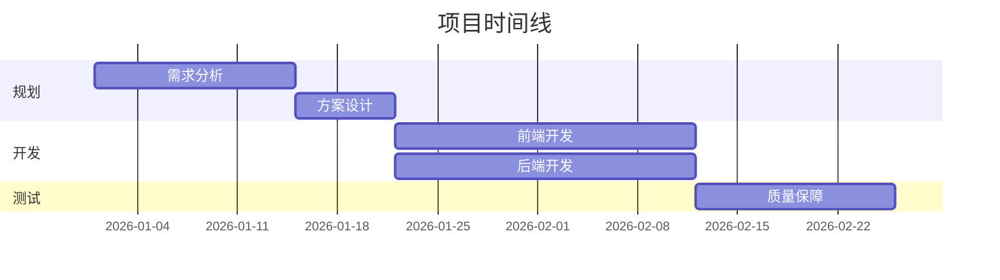

# 图表技能

使用 Mermaid 或 PlantUML 语法生成技术图表。

## 适用场景

✅ **使用此技能的场景：**

- 绘制系统架构图
- 创建 API 交互时序图
- 可视化业务流程
- 生成数据库 ER 图
- 生成 OOP 设计类图
- 创建项目甘特图

## 不适用场景

❌ **不使用此技能的场景：**

- 简单文字说明即可表达时
- 图表用于演示文稿（请使用专业设计工具）
- 需要像素级精确设计时（请使用 Figma/Sketch）

## Mermaid 语法

### 流程图



### 时序图



### 类图



### ER 图



### 甘特图



## 渲染方式

### Mermaid CLI

```bash
# 渲染为 PNG
npx @mermaid-js/mermaid-cli -i diagram.mmd -o diagram.png

# 渲染为 SVG
npx @mermaid-js/mermaid-cli -i diagram.mmd -o diagram.svg

# 使用暗色主题
npx @mermaid-js/mermaid-cli -i diagram.mmd -o diagram.png -t dark
```

### PlantUML

```bash
# 生成 PlantUML 源码（需要 PlantUML 服务器或本地 jar）
# 保存为 .puml 文件，通过 plantuml.com/plantuml 渲染
java -jar plantuml.jar diagram.puml
```

## 输出规范

- Mermaid 文件保存为 `.mmd`，存放于 `shared/diagrams/`
- PlantUML 文件保存为 `.puml`，存放于 `shared/diagrams/`
- 使用描述性文件名：`user-auth-flow.mmd`、`db-schema.puml`
- 图表中必须包含标题

## 最佳实践

- 每张图表聚焦一个概念
- 保持方向一致（流程图用 TD，时间线用 LR）
- 节点数控制在 15-20 个以内，确保可读性
- 所有连线/关系必须添加标签
- 使用子图（subgraph）对相关组件分组
